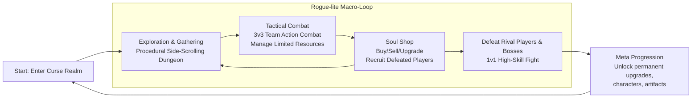
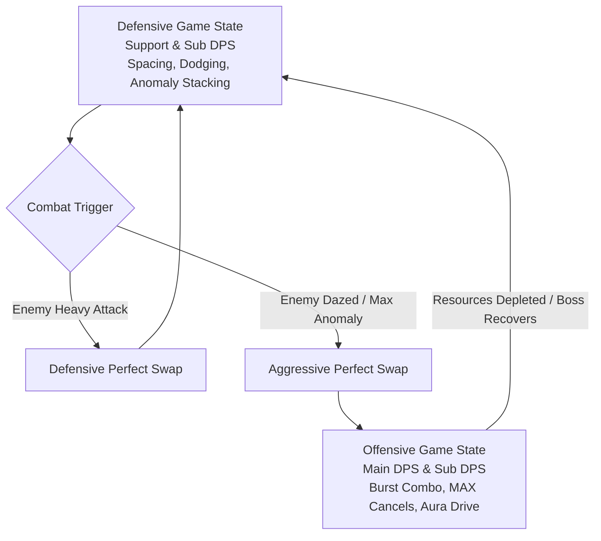

# JJK สำเพ็ง — Game Design Document

## Purpose

This document is the shared north star for AI coders, senior engineers, technical designers, and future contributors working on **JJK สำเพ็ง**.

It has two equally important jobs:

1. Preserve the intended identity of the game.
2. Give the current prototype a clean technical direction without pretending that the clean architecture already exists.

Read this as a **design-led execution charter**:

- The **game fantasy, emotional tone, and player loop are authoritative**.
- The **current codebase is prototype truth**, not final architecture.
- Any refactor must protect the intended player experience while improving maintainability.

---

<!-- @tag:identity -->
## Project Identity

| Field | Direction |
| --- | --- |
| Working Title | **JJK สำเพ็ง** |
| Genre | **2D Fighting-action game / Side-scrolling / Roguelite / Singleplayer** |
| Theme & Tags | **Anime-like / Death Game / Thailand & Chinese Culture / Dark Magical Powers / Character-Driven Action / Dark Fantasy / Afterlife / Alienation Urban City** |
| Core Fantasy | **Being the strongest Player. Beat them and acquire them** |
| Player Promise | **Set within a supernatural Asian death game, this dark anime side-scrolling rogue-lite merges the mechanical precision of traditional fighting games with the stylish character fantasy of modern action RPGs. With its party-based mechanics, the gameplay aims for a 'low floor, high ceiling' mastery.** |
| Platform Priority | **PC** |
| Camera / Play Plane | **2D Side-scrolling** |
| Tone | **Dark Fantasy / Exciting / Epic / Thrilling** |
| Story Intent | **"Shin" died and was transported into Death Game Cursed Realm by Spirit Waifu name "Blind" and discovered that all players contain a Cursed Technique called "Aura" that amplify their fighting spirit to fight Monster "Fiend". All of you are rival and your enemy is your time. No matter you died in Curse Realm you will respawn at the beginning but only  1 out of 50 Players can survive and brought back to life so if you are getting back behind, you will forget who you are and become a one of "Fiend".** |

### Experience Pillars

1. **Intense Combat Balancing Power Fantasy & Hardcore**
   - **Player Execution**: Fluid combos, juggling, and precise animation cancels. Action states (Basic Attacks, Air Attacks, Skills, Ultimates, Plunge) feel like *Blazblue Entropy Effect* and *Wuthering Waves*.
   - **Anomaly & Daze System**: Characters have unique passive effects that can be stacked on enemies to trigger powerful burst effects. Build up the Anomaly Gauge and Daze Gauge to trigger a Daze state, making the enemy vulnerable to act. (like *Zenless Zone Zero*)
   - **High-Risk/Reward Neutral**: Player actions have wind-up, active, and recovery frames. Missing or mis-timing a move is highly punishable (inspired by *King of Fighters XIII*).
   - **Boss Encounters**: High-stakes 1v1 duels requiring precise spacing, timing, counters, and combo maintenance.
   

2. **Beat Them and Acquire Them**
   - **Defeat Bosses**: Defeating other players (bosses) in the Cursed Realm unlocks them as playable characters in your pool.
   - **Soul Shop**: Shop for selling what you get from previously run (like *Dead Cell*) such as Character, Artifact, Items etc and Purchase and recruit defeated players to build your team.
      

3. **Rogue-lite Mechanics**
   - **Soul System (Character Potential)**: Upgradable character progression that unlocks new combo routes, modifies passive loops, and changes skill utilities.
   - **Artifact System**: Passive and active power-ups found during Cursed Realm runs.

4. **Team Synergy (3-Character Hybrid Squad)**
   - **Role-based Dynamics**: Assemble a team of 3 characters: Main DPS (on-field builder/finisher), Sub DPS (quick-swap burst/applicator), and Support (shields, heals, buffs).
   - **Reactive Perfect Swaps**: Swap characters dynamically during critical defensive or offensive moments to generate gauges, build stagger, and maintain pressure without losing momentum.
   

---

<!-- @tag:visual-audio -->
## Visual, Mood, and Audio Direction

### Mood Board Keywords

- {keyword}
- {keyword}
- {keyword}

### Art Direction

{Describe the art style, character design, environment style, contrast rules.}

### Audio Direction

{Describe the sound design philosophy — is sound informational? atmospheric? both? What role does silence play?}

---

<!-- @tag:platform-input -->
## Platform and Input Philosophy


### Primary Rule

**PC Keyboard & Mouse is the authoritative input model.** Gamepad controller support is a mapped port layer mirroring the exact same verb set and timing windows, without redesigning combat around precision differences.

### PC Keyboard & Mouse Controls

| Input | Combat Verb | Description / Behavior |
| --- | --- | --- |
| **A / D** | Move Left / Right | Horizontal locomotion. Dash cancels can be directed by holding A or D. |
| **Space** | Jump | Double jump supported. Press in air to double jump. |
| **LMB** | Basic Attack (BA) | Performs state-based basic attack chains on the ground or in the air. |
| **Shift** | Dash / Evade | Invincibility-frame dash. Can cancel active animations if high in the hierarchy. |
| **RMB** | Skill | Triggers character-specific skill. Directional movement changes skill form. |
| **Q** | Ultimate | Triggers character ultimate. Consumes 3 AG + 2 DG. |
| **E** | Consume Drive Gauge | Consume Drive Gauge to enter MAX CANCEL animation Cancel
| **S (in air) + LMB** | Plunge Attack | Initiates downward plunge. Locks movement until recovery frame. |
| **S (on platform)** | Drop down | Drop down to the platform below. |
| **1, 2, 3** | Team Swap | Swaps active character to slot 1, 2, or 3. Consumes 1 AG (0 if Perfect Swap). |

### Input Buffering & Queueing

1. **Buffer Window**: The system maintains a **12-frame input buffer**. Inputs registered within 12 frames of an active action ending are queued and executed on the first possible frame.
2. **Buffer Hierarchy Override**: High-priority inputs (System/Ability/Skill) in the buffer queue override lower-priority inputs (Basic Attack/Movement).
3. **Double Inputs**: Command motions (e.g. S + LMB) are read atomically, preventing split inputs from polluting the buffer.

---

<!-- @tag:core-loop -->
## Core Game Loop

   

### The Rogue-lite (Macro-Loop)(Ref: Blazblue Entropy Effect)

1. **Enter Curse Realm (Run Start Dungeon)**: Spawn at the beginning of the procedurally generated side-scrolling map with empty shell of character and 0 resources.
2. **Exploration & Gathering (Side Scrolling)**: Explore the dungeon and fight enemies using your resources. main purpose is the gathering useful resources.
3. **Engage in combat (Tactical)**: Fight the dungeon by using your limited resources and collect enemy souls that they will become playable characters after you defeat them which appear on soul shop.
4. **Soul Shop (Upgrade & Build Team)**: the shop sold what you have encounter in run such as Character, Artifact, Items, etc. You can buy, sell, use resources to upgrade potentials of characters, acquire defeated characters as playable characters, and prepare for the next run. (Like *Dead Cells*)
5. **Defeat Rival Players & Bosses(Final Showdown)**: shift to 1v1 fighting game that required high skills to beat them to progress through the game.
6. **Dead (return to Start)**: If the player is defeated they will lose all coin and characters they have gathered in the current run and will return to the start. only MetaProgression will be retained such as Artifact and Character Potential.



### Tactical Combat States (Micro-Loop)




#### 1. Defensive Game State (Neutral & Spacing)

- **Goal**: Minimize damage taken, build combat resources, and prep enemies for burst damage.

- **Focus Characters**: Support & Sub DPS.
- **Activities**:
  - Maintaining distance (spacing) and timing dodges to trigger Perfect Dodge.
  - Building Anomaly Gauges using basic attacks (BA) and skills.
  - *Reaction Loop*: If the enemy attacks with a **Heavy Attack**, the player performs a **Defensive Perfect Swap** to switch character mid-impact, avoiding damage, gaining DG/AG, and continuing to combo.

#### 2. Offensive Game State (Burst & Kill)

- **Goal**: Maximize damage in a safe window, consume stored resources, and eliminate threats.

- **Focus Characters**: Main DPS & Sub DPS.
- **Activities**:
  - Activated when an enemy enters **Daze** (staggered) or has an **Anomaly Maxed**.
  - Trigger an **Aggressive Perfect Swap** to the Main DPS.
  - Maintain the juggle/combo on the enemy. Use **Drive Gauge (DG)** for MAX Cancels to extend strings.
  - Consume AG and DG to execute Ultimate abilities, or enter **Aura Drive Mode** to temporarily bypass the cancel hierarchy entirely.
  - Transition back to the Defensive State once resources are exhausted or the enemy recovers (or breaks the combo).

### Progression Cadence

- **Run Scaling**: Enemy health, speed, and aggression scale over time.
- **Rival Escalation**: Defeating bosses unlocks new playable character blueprints. Character potentials (Soul System) alter the timing windows and cancel options of standard attacks, making combos longer and more lethal as the player progresses.

### Failure / Recovery Pattern

- **Failure Curve**: Character deaths do not end the run immediately; the remaining team members must carry the fight. The run fails only when all three characters are defeated (Team Wipe).
- **Punishment**: Upon a Team Wipe, the player respawns at the beginning of the Cursed Realm. They lose run-specific artifacts and active progress, but retain unlocked character blueprints and Soul Shop upgrades.
- **Dementing Narrative**: Each defeat causes the player to lose a piece of their memories. If they drop too far behind the survival rate, they transform into a "Fiend" (the enemy monsters).

<!-- @tag:characters-general-mechanics -->
## Characters System

### 1. Character Data

#### 1.1 Character Stats


| Stats | Value | Description |
| --- | --- | --- |
| ATK | 100 | Attack |
| DEF | 100 | Defense |
| HP | 1000 | Health |
| DGR | XX% | Drive Gauge Regen Mastery |
| AGR | XX% | Aura Gauge Regen Mastery |
| CDR | XX% | Cooldown Reduction Mastery |
| CRIT | XX% | Critical Rate |
| CRIT Dmg | XX% | Critical Damage |
| Debuff Mastery | XX% | Debuff Mastery |
|DMG Mastery| XX% | Damage Mastery |
|DMG Res| XX% | Damage Resistance |

### 1.12 Character Stats Formula

Base Damage
$$\text{Base Damage} = \text{ATK}_{\text{attacker}} \times \text{Motion Value (Skill Multiplier)}$$
Addition Damage
$$\text{Damage Mastery Multiplier} = 1 + \text{DMG Mastery}_{\text{attacker}}%$$
Critical Multiplier
$$\text{Final Damage} = \text{Base Damage} \times (1 + \text{Critical Rate} \times \text{Critical Damage})$$
Additional Buff
$$\text{Combo/Buff Multiplier} = 1 + \sum \text{Buff Bonuses} + \text{Artifact Modifiers}$$

#### Final Damage

$$\text{Final Damage} = \text{Base Damage} \times \text{Damage Mastery Multiplier} \times \text{Critical Multiplier} \times \text{Combo/Buff Multiplier}$$

---
Defense Factor
$$\text{Defense Factor} = \frac{K}{K + \text{DEF}_{\text{defender}}}$$

Damage Scaling Example

If $\text{DEF} = 100$, the defender takes $\frac{400}{500} = 0.8$ or 20% damage received.

If $\text{DEF} = 400$, the defender takes $\frac{400}{800} = 0.5$ or 50% damage received.

#### Final Damage Taken

$$\text{Receive Damage} = \text{Final Damage} \times \text{Defense Factor} \times \text{Damage Resistance Multiplier} \times \text{Vulnerability Factor}$$

---

#### 1.2 Character Roles & Archetypes


### **DPS**

- High Burst (Reaper)
  - High Mobility / High DPS / Low Survivality
- Sustained Damage (Execution)
  - Medium to High DPS / Medium Survivality

### **Sub-DPS**

- Buffer (Herald)
  - High Buffer / Utility / Low Survivality
- Debuffer (Arbiter)
  - High Debuffer / Utility / Low Survivality

### **Support**

- Shield / Healing / Tank (Vanguard)
  - High Survivality / Utility / Low DPS

### 2. Character Upgrades (Soul System)

- Every character has 2 types of Upgrade System Window
  - **Potential System**: a Permenent upgrades for expand characters ability (Combo Route / Passive) that seperate into 6 levels
  - **Artifact Equip System**: a Inventory-like that Increase some stats or gain passive ability character can be equipped up to 3 artifacts

#### 2.1 Character Potential System

xxx

#### 2.2 Character Artifact Equip System

xxx

<!-- @tag:character-movement-mechanics -->
## Character State Machine

#### Physic & Movement State

<!-- @tag:character-combat-mechanics -->
## Character Combat Mechanics

### 1. Team Swap System

Combat features a 3-character squad with shared resources.


- **Role Classification**:
  - **Main DPS**: High on-field presence, executes core combos and sustained loops.
  - **Sub DPS**: Quick-swap burst, dumps Skills/Ultimates, applies status anomalies.
  - **Support**: Defensive utility (shields/heals) and team-wide offensive buffs.
- **Swap Mechanics**:
  - **Standard Swap**: Costs **1 AG**.
  - **Perfect Swap**: Reactive swap costing **0 AG** that inflicts heavy Daze damage and generates DG/AG.
    - **Defensive**: Triggered by swapping mid-impact when hit by an enemy **Heavy Attack**.
    - **Aggressive**: Triggered by swapping when hitting a **Dazed** enemy with a player **Heavy Attack**.
  - **Punishment**: Poorly timed swaps expose incoming characters directly to active enemy hitboxes.

---

### 2. Combat Action System


Every character has actions governed by distinct Wind-up (SF), Active (AF), and Recovery (RF) animation frames:

- **Basic Attack (BA)**: Ground combo chain (e.g., BA S1 Flick $\rightarrow$ BA S2 Knockback $\rightarrow$ BA S3 Knock Up) required to trigger passive loops.
- **Basic Air Attack (AS)**: Aerial combo. Automatically triggers in air/launch. Gravity lerps down during RF.
- **Skill**: Custom ability. Cancels BA. Cooldown-gated. A/D inputs steer/alter trajectory or form.
- **Ultimate (Ult)**: High-damage finisher. Cancels Skill. Costs **3 AG + 2 DG**.
- **Plunge Attack**: Ground-slam. Cancels air attacks. Triggers minor vertical lift, then descent (steerable with A/D). Landing RF cannot be canceled.

---

### 3. Cancel Hierarchy & Animation Speed

High-priority actions cancel lower actions during SF/AF. Lower-priority actions cancel higher ones only during RF.

| Priority | Level | Actions | Cancel Conditions |
| :---: | :--- | :--- | :--- |
| **0** | **System** | Reaction / MAX Cancel (MC) / Team Swap | Bypasses all normal hierarchy checks. |
| **1** | **Ability** | Dash (Shift) / Jump / Plunge | Cancels Skill/Basic recovery frames (RF). |
| **2** | **Special** | Skill / Ultimate | Cancels Basic Attack active (AF) / recovery (RF) frames. |
| **3** | **Combo** | Ground / Air Basic Attack | Cancels Movement recovery frames (RF). |
| **4** | **Loco** | Movement Inputs (WASD) | Lowest priority. Cannot cancel other actions. |

- **Animation Cancel (C)**: Standard cancel into a higher-priority action. Increases the next action's animation speed by **20%** (does not stack; does not apply to Ultimates).
- **Counter**: Hitting an enemy hurtbox during their Wind-up staggers and interrupts their attack.

---

### 4. MAX Cancel (MC)


- **Cost**: **1 DG**.

- **MC during Start-up / Active**: Cuts active animation, entering a 1-frame MC state cancelable by *any* action (System priority).
- **MC during Recovery**: Cancels recovery and caches the next BA sequence state.
  - *Example*: `BA S1 -> BA S2 -> BA S3 -> MC(RF) -> Skill -> MC Cache Consumed -> BA S4`.
- **Rules**: Team swaps clear the active MC cache. Performing a new MC does not stack the cache.

---

### 5. Anomaly System

Elemental status buildup. Maxing the Anomaly Gauge triggers a reaction:

- **Red (Fire)**: Burn (heavy DoT).
- **Blue (Ice)**: Frozen (completely immobilizes).
- **Green (Wind)**: Defense shred or pull-in (TBD).
- **Yellow (Lightning)**: Paralysis shocks (interrupts actions).
- **Purple (Dark)**: Vulnerability debuff (increases damage received).


---

### 6. Combat Physics & Balance

- **Stun & Daze**: Attacking builds the Daze gauge. Maxing it triggers **Stun** (immobile & vulnerable).

- **Break (Combo Breaker)**: Non-stunned grounded enemies eventually trigger a **Break**, knocking the player back and entering a brief slow-motion window.
- **Juggle & Gravity Punish**: Repeating a launcher in the same air combo increases the gravity constant (enemy falls faster).
- **Flick / Knock Back**: Horizontal ground knockback.
- **Ground/Wall Bounce**: Knocking airborne enemies into walls/ground bounces them, resetting their gravity punish gauge.

---

### 7. Player Resource Loop

Shared resources across the 3-character team.


```
Drive Gauge (DG)  [  DG 1  ] [  DG 2  ]  -> Max 100 units (50/charge)
Aura Gauge (AG)   [ AG 1 ] [ AG 2 ] [ AG 3 ] [ AG 4 ] [ AG 5 ]  -> Max 500 units (100/charge)
```

- **Drive Gauge (DG)**:
  - **Gain**: Taking damage, Perfect Dodge, or Perfect Swap.
  - **Spend**:
    - **MAX Cancel**: Costs **1 DG** charge.
    - **Aura Drive Mode**: Costs **2 DG** (requires full gauge). Grants an empowered state that bypasses the Cancel Hierarchy (e.g., `BA S1 -> Skill -> BA S1 -> Ult -> BA S1`). Character swap immediately ends Aura Drive.
- **Aura Gauge (AG)**:
  - **Gain**: Landing basic attacks, Perfect Dodge, or Perfect Swap.
  - **Spend**:
    - **Team Swap**: Costs **1 AG** (0 AG if Perfect Swap).
    - **Ultimate**: Costs **3 AG** (plus requires 2 DG).

<!-- @tag:items -->
## Canonical Gameplay Content — Artifacts

| Artifact | Role | Intended Effect |
| --- | --- | --- |
| {Artifact Name} | {role} | {mechanical effect} |
| {Artifact Name} | {role} | {mechanical effect} |

---

<!-- @tag:enemies -->
## Canonical Gameplay Content — Enemies and Threats

### {Enemy Name}

**Role:** {one-sentence role description}

**Design intent**

- {behavior 1}
- {behavior 2}
- {behavior 3}

**Counterplay**

- {how the player deals with this threat}

---

<!-- @tag:inspirations -->
## Inspirations and Design Boundaries

### Primary Inspirations

- KOFXIII
- Blazblue Entropy Effect
- Zenless Zone Zero
- Honkai Impact
- Punishing Gray Raven
- Wuthering Wave
- Hollow Knight
- JJK Anime

### What To Borrow

- KOFXIII : Fast-Paced Fighting Game-like
- Blazblue Entropy Effect : Rogue-like element & Skill Upgrade System
- Zenless Zone Zero : Team Combat Mechanics & Skill Designs
- Honkai Impact & Punishing Gray Raven : Character Design
- Wuthering Wave : Artstyle
- Hollow Knight : Atmosphere & World Design & Exploration
- JJK Anime : Story & Narrative

### What Not To Copy Blindly

- {anti-pattern for this project}

---

<!-- @tag:tech-stack -->
## Actual Project Stack and Repo Reality

> This section reflects the repository **as it exists today**.

### Technical Stack

| Area | Current Repo Truth |
| --- | --- |
| Engine | **{engine and version}** |
| Render Pipeline | **{pipeline}** |
| Gameplay Dimension | **{2D / 3D}** |
| Input | **{input system}** |
| Camera | **{camera system}** |
| UI | **{UI framework}** |
| Networking | **{networking solution or "None"}** |
| Build Scenes | {list of scenes in build settings} |

---

<!-- @tag:prototype-truth -->
## Current Prototype Truth

> This is the most important reality check for future contributors.

**The current implementation already contains usable gameplay ideas, but it is still prototype-grade.**

### Existing Runtime Shape

{Describe the actual current architecture — singletons, scene wiring, state management.}

### What Exists Today

#### {System Name}

Current script: `{path}`

What it currently does:

- {behavior 1}
- {behavior 2}

### Current Prototype Debt

- {technical debt item 1}
- {technical debt item 2}
- {technical debt item 3}

---

<!-- @tag:scene-roles -->
## Canonical Future Scene Roles

| Scene Role | Purpose |
| --- | --- |
| `{SceneName}` | {purpose} |
| `{SceneName}` | {purpose} |

---

<!-- @tag:system-ownership -->
## Canonical Future System Ownership

| System | Ownership |
| --- | --- |
| `{SystemName}` | {responsibility} |
| `{SystemName}` | {responsibility} |

### Hard Rule

No future refactor should dump new features back into a single global MonoBehaviour just because it is faster in the short term.

---

<!-- @tag:architecture -->
## Target Architecture Direction

### Architecture Principles

1. **Game design authority first**
   The mood, pace, pressure, and {primary platform}-first loop are more important than neat code alone.

2. **Data-driven content**
   {Content types} should move toward authorable data assets rather than hardcoded scene logic.

3. **Thin scene wiring**
   Scenes should assemble references and presentation. They should not permanently own progression logic.

4. **State separated from presentation**
   UI, animation, sound, and VFX should react to gameplay state instead of defining it.

5. **Explicit module boundaries**
   {List of systems} should be individually testable or replaceable.

### Recommended Folder Direction

*(See `RULES_AND_POLICY.md` §3 for the standard folder structure.)*

### Data-Driven Content Targets

- `{Name}Definition` — {what it owns}
- `{Name}Definition` — {what it owns}

---

<!-- @tag:guardrails -->
## Contributor Guardrails

### Preserve These Non-Negotiables

- {design constraint 1}
- {design constraint 2}

### You May Refactor Aggressively

- {area open for refactor}

### Do Not Do These

- {anti-pattern 1}
- {anti-pattern 2}

### Naming Policy

*(See `RULES_AND_POLICY.md` §2 for the standard naming conventions.)*

### AI Safety Rule

Every future implementation must clearly separate **current implementation** from **target architecture**. Do not hallucinate completed architecture.

---

<!-- @tag:roadmap -->
## Phased Refactor Roadmap

### Phase 1 — Stabilize the Prototype

**Goal:** Make the current game loop less fragile without changing the design identity.

- {priority 1}
- {priority 2}

### Phase 2 — Split Core Runtime Systems

**Goal:** Break the prototype monolith into clear system owners.

- {priority 1}
- {priority 2}

### Phase 3 — Data-Drive Content

**Goal:** Make content authorable without rewriting runtime code.

- {priority 1}
- {priority 2}

### Phase 4 — Vertical Slice

**Goal:** Turn the core loop into a production-worthy slice.

- {priority 1}
- {priority 2}

### Phase 5 — Expand Content and Port Readiness

**Goal:** Scale content while preserving {primary platform}-first usability.

- {priority 1}
- {priority 2}

---

## Final Instruction To Contributors

When working on **JJK สำเพ็ง** do not optimize only for clean code and do not optimize only for vibes.

The correct target is:

- **emotionally faithful Action-Fighting design**
- **PC-first readable gameplay**
- **data-driven scalable architecture**
- **clear ownership instead of prototype sprawl**

If a choice improves architecture but weakens **Challenging Power Fantasy**, it is the wrong choice.
If a choice preserves mood but makes the code impossible to scale, it is also the wrong choice.

Build toward both.
