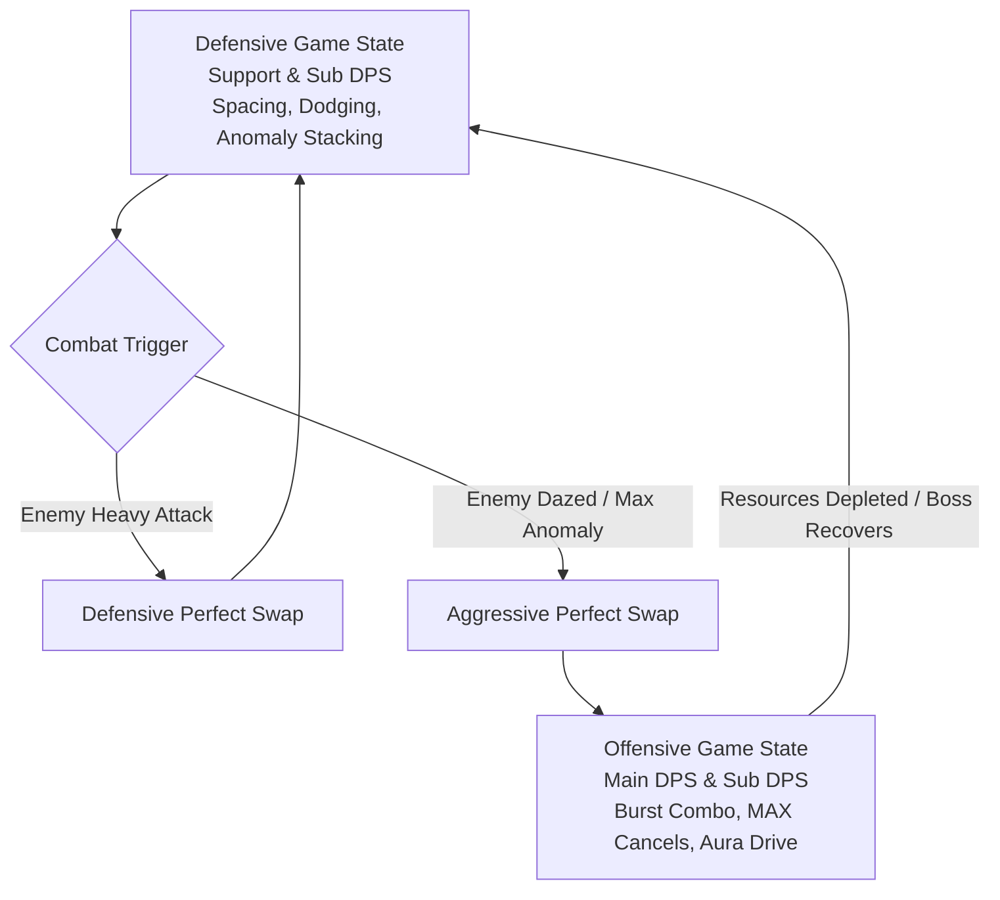

# JJK สำเพ็ง — Game Design Document

## Purpose

This document is the shared north star for AI coders, senior engineers, technical designers, and future contributors working on **JJK สำเพ็ง**.

It has two equally important jobs:

1. Preserve the intended identity of the game.
2. Give the current prototype a clean technical direction without pretending that the clean architecture already exists.

Read this as a **design-led execution charter**:

- The **game fantasy, emotional tone, and player loop are authoritative**.
- The **current codebase is prototype truth**, not final architecture.
- Any refactor must protect the intended player experience while improving maintainability.

---

<!-- @tag:identity -->
## Project Identity

| Field | Direction |
| --- | --- |
| Working Title | **JJK สำเพ็ง** |
| Genre | **2D Fighting-action game / Side-scrolling / Roguelite / Singleplayer** |
| Theme & Tags | **Anime-like / Death Game / Thailand & Chinese Culture / Dark Magical Powers / Character-Driven Action / Dark Fantasy / Afterlife / Alienation Urban City** |
| Core Fantasy | **Being the strongest Player. Beat them and acquire them** |
| Player Promise | **A dark anime side-scrolling roguelite in theme of supernater Asian worldsetting Death game, combining the precision of traditional fighting games with the stylish character fantasy of modern anime action RPGs with party-based and character-potential rogue-lite.** |
| Platform Priority | **PC** |
| Camera / Play Plane | **2D Side-scrolling** |
| Tone | **Dark Fantasy / Exciting / Epic / Thrilling** |
| Story Intent | **"Shin" died and was transported into Death Game Cursed Realm by Spirit Waifu name "Blind" and discovered that all players contain a Cursed Technique called "Aura" that amplify their fighting spirit to fight Monster "Fiend". All of you are rival and your enemy is your time. No matter you died in Curse Realm you will respawn at the beginning but only  1 out of 50 Players can survive and brought back to life so if you are getting back behind, you will forget who you are and become a one of "Fiend".** |
|Main Reference|**Jujutsu Kaisen (Story & Theme) / Blazblue Entropy Effect (Combat Motion & Effect & Rogue-lite System) / Wuthering Wave (Combat Motion & Feel & Artstyle) / KOFXIII (Combat Gameplay & Polish & Boss Design) / Hollow Knight (Atmosphere & World Design & Exploration)**|

### Experience Pillars

1. **Intense Combat Balancing Power Fantasy & Hardcore**
   - **Player Execution**: Fluid combos, juggling, and precise animation cancels. Action states (Basic Attacks, Air Attacks, Skills, Ultimates, Plunge) feel like *Blazblue Entropy Effect* and *Wuthering Waves*.
   - **High-Risk/Reward Neutral**: Player actions have wind-up, active, and recovery frames. Missing or mis-timing a move is highly punishable (inspired by *King of Fighters XIII*).
   - **Boss Encounters**: High-stakes 1v1 duels requiring precise spacing, timing, counters, and combo maintenance.
   

2. **Beat Them and Acquire Them**
   - **Defeat Bosses**: Defeating other players (bosses) in the Cursed Realm unlocks them as playable characters in your pool.
   - **Soul Shop**: Purchase and recruit defeated players to build your team.
      

3. **Rogue-lite Mechanics**
   - **Soul System (Character Potential)**: Upgradable character progression that unlocks new combo routes, modifies passive loops, and changes skill utilities.
   - **Artifact System**: Passive and active power-ups found during Cursed Realm runs.

4. **Team Synergy (3-Character Hybrid Squad)**
   - **Role-based Dynamics**: Assemble a team of 3 characters: Main DPS (on-field builder/finisher), Sub DPS (quick-swap burst/applicator), and Support (shields, heals, buffs).
   - **Reactive Perfect Swaps**: Swap characters dynamically during critical defensive or offensive moments to generate gauges, build stagger, and maintain pressure without losing momentum.
   

---

<!-- @tag:visual-audio -->
## Visual, Mood, and Audio Direction

### Mood Board Keywords

- {keyword}
- {keyword}
- {keyword}

### Art Direction

{Describe the art style, character design, environment style, contrast rules.}

### Audio Direction

{Describe the sound design philosophy — is sound informational? atmospheric? both? What role does silence play?}

---

<!-- @tag:platform-input -->
## Platform and Input Philosophy


### Primary Rule

**PC Keyboard & Mouse is the authoritative input model.** Gamepad controller support is a mapped port layer mirroring the exact same verb set and timing windows, without redesigning combat around precision differences.

### PC Keyboard & Mouse Controls

| Input | Combat Verb | Description / Behavior |
| --- | --- | --- |
| **A / D** | Move Left / Right | Horizontal locomotion. Dash cancels can be directed by holding A or D. |
| **Space** | Jump | Double jump supported. Press in air to double jump. |
| **Left Click (LMB)** | Basic Attack (BA) | Performs state-based basic attack chains on the ground or in the air. |
| **Right Click (RMB) / Shift** | Dash / Evade | Invincibility-frame dash. Can cancel active animations if high in the hierarchy. |
| **E** | Skill | Triggers character-specific skill. Directional movement changes skill form. |
| **Q** | Ultimate | Triggers character ultimate. Consumes 3 AG + 2 DG. |
| **S (in air) + LMB** | Plunge Attack | Initiates downward plunge. Locks movement until recovery frame. |
| **1, 2, 3** | Team Swap | Swaps active character to slot 1, 2, or 3. Consumes 1 AG (0 if Perfect Swap). |

### Input Buffering & Queueing

1. **Buffer Window**: The system maintains a **12-frame input buffer**. Inputs registered within 12 frames of an active action ending are queued and executed on the first possible frame.
2. **Buffer Hierarchy Override**: High-priority inputs (System/Ability/Skill) in the buffer queue override lower-priority inputs (Basic Attack/Movement).
3. **Double Inputs**: Command motions (e.g. S + LMB) are read atomically, preventing split inputs from polluting the buffer.

---

<!-- @tag:core-loop -->
## Core Game Loop

   

The fundamental macro loop is:

1. **Enter Curse Realm (Run Start)**: Spawn at the beginning of the procedurally generated side-scrolling map with a 3-character team.
2. **Defensive Spacing & Setup (Neutral)**: Engage enemies using Support and Sub DPS characters. Focus on spacing, dodges, and building Anomaly status stacks.
3. **Execute Perfect Swaps (Transition)**: Transition between team members during enemy attacks (Defensive) or stagger windows (Aggressive) to build Drive Gauge (DG) and Aura Gauge (AG).
4. **Unleash Burst Combos (Offense)**: Swap in the Main DPS during Daze or Max Anomaly states, using Drive Gauge for MAX Cancels or entering Aura Drive Mode to burst down high-threat targets.
5. **Defeat Rival Players & Bosses (Upgrade)**: Conquer boss fights. Acquire defeated players as playable characters, return to the Soul Shop, upgrade potentials, and prepare for the next run.

### Tactical Combat States (Micro-Loop)




#### 1. Defensive Game State (Neutral & Spacing)

- **Goal**: Minimize damage taken, build combat resources, and prep enemies for burst damage.

- **Focus Characters**: Support & Sub DPS.
- **Activities**:
  - Maintaining distance (spacing) and timing dodges to trigger Perfect Dodge.
  - Building Anomaly Gauges using basic attacks (BA) and skills.
  - *Reaction Loop*: If the enemy attacks with a **Heavy Attack**, the player performs a **Defensive Perfect Swap** to switch character mid-impact, avoiding damage, gaining DG/AG, and continuing to combo.

#### 2. Offensive Game State (Burst & Kill)

- **Goal**: Maximize damage in a safe window, consume stored resources, and eliminate threats.

- **Focus Characters**: Main DPS & Sub DPS.
- **Activities**:
  - Activated when an enemy enters **Daze** (staggered) or has an **Anomaly Maxed**.
  - Trigger an **Aggressive Perfect Swap** to the Main DPS.
  - Maintain the juggle/combo on the enemy. Use **Drive Gauge (DG)** for MAX Cancels to extend strings.
  - Consume AG and DG to execute Ultimate abilities, or enter **Aura Drive Mode** to temporarily bypass the cancel hierarchy entirely.
  - Transition back to the Defensive State once resources are exhausted or the enemy recovers (or breaks the combo).

### Progression Cadence

- **Run Scaling**: Enemy health, speed, and aggression scale over time.
- **Rival Escalation**: Defeating bosses unlocks new playable character blueprints. Character potentials (Soul System) alter the timing windows and cancel options of standard attacks, making combos longer and more lethal as the player progresses.

### Failure / Recovery Pattern

- **Failure Curve**: Character deaths do not end the run immediately; the remaining team members must carry the fight. The run fails only when all three characters are defeated (Team Wipe).
- **Punishment**: Upon a Team Wipe, the player respawns at the beginning of the Cursed Realm. They lose run-specific artifacts and active progress, but retain unlocked character blueprints and Soul Shop upgrades.
- **Dementing Narrative**: Each defeat causes the player to lose a piece of their memories. If they drop too far behind the survival rate, they transform into a "Fiend" (the enemy monsters).

---

<!-- @tag:items -->
## Canonical Gameplay Content — Items

| Item | Role | Intended Effect |
| --- | --- | --- |
| {Item Name} | {role} | {mechanical effect} |
| {Item Name} | {role} | {mechanical effect} |

---

<!-- @tag:enemies -->
## Canonical Gameplay Content — Enemies and Threats

### {Enemy Name}

**Role:** {one-sentence role description}

**Design intent**

- {behavior 1}
- {behavior 2}
- {behavior 3}

**Counterplay**

- {how the player deals with this threat}

---

<!-- @tag:mechanics -->
## System Mechanics

This section defines the core rules governing character attributes, combos, resources, and environmental physics.

### 1. Team Synergy & Swap System


Combat relies on a 3-character hybrid squad where characters are swapped on-field dynamically. The team slots are unchangeable until modified in the Soul Shop.

#### Role Classification

- **Main DPS**: Stays on-field for extended periods. Executes high-damage combo strings and sustains character-specific passive loops.
- **Sub DPS**: Swaps in to quickly dump Skills and Ultimates, apply status anomalies, and swaps out to keep the rotation fluid.
- **Support**: Focuses on defensive utilities (shields, heals) and offensive buffs. Support characters are crucial for setup during neutral play.

#### Team Swap Mechanics

- **Swap Cost**: Standard team swaps require **1 Aura Gauge (AG)** unit.
- **Perfect Swap (Reactive swaps)**: High-reward swaps triggered by specific combat states:
  - **Defensive Perfect Swap**: Swap instantly when your active character is hit by an enemy **Heavy Attack**.
  - **Aggressive Perfect Swap**: Swap instantly when hitting an enemy in **Daze** state with a player **Heavy Attack**.
  - **Perfect Swap Rewards**: Consumes **0 AG**, inflicts massive Daze damage to the enemy, and generates both Drive Gauge (DG) and Aura Gauge (AG).
- **Punishment**: Poorly timed swaps place a fragile character directly into active enemy hitboxes, exposing them to damage or wasting AG if the swapped-in character misses their action.

---

### 2. Combat Action System


Every playable character features a unified set of combat actions governed by distinct animation frame states (Wind-up, Active, Recovery):

- **Basic Attack (BA)**: Ground combo chain split into sequential states (e.g. BA S1 Flick -> BA S2 Knockback -> BA S3 Knock Up). Certain passive loops require the execution of specific BA states.
- **Basic Air Attack (AS)**: Aerial combo chain with a dedicated state machine. Automatically triggered if the player attacks while falling or after launching an enemy. Gravity lerps down during recovery frames.
- **Skill**: Custom character ability. Can cancel Basic Attacks. Has a cooldown. Pressing directional movement inputs (A/D) during execution alters the skill's trajectory or form.
- **Ultimate (Ult)**: High-damage finisher. Can cancel Skills. Requires and consumes **3 AG + 2 DG**.
- **Plunge Attack**: Ground-slam attack. Can cancel air attacks. Executing a Plunge triggers a minor vertical lift before descending. The player can adjust the landing location horizontally with A/D. A Plunge cannot be canceled until it enters its landing recovery frame.

---

### 3. Cancel Hierarchy

Input buffering and combo chaining are governed by a strict Priority Hierarchy. Lower-priority actions can only cancel higher-priority actions during their **Recovery Frame (RF)**, whereas higher-priority actions can cancel lower-priority actions during their **Active Frame (AF)** or **Wind-up Frame (SF)**.

| Priority | Action Level | Included Actions | Cancel Conditions |
| :---: | :--- | :--- | :--- |
| **0** | **System** | Reaction / MAX Cancel (MC) / Team Swap | Bypasses all normal hierarchy checks. |
| **1** | **Ability** | Dash (Shift) / Jump / Plunge | Cancels Skill/Basic recovery frames. |
| **2** | **Special Action** | Skill / Ultimate | Cancels Basic Attack active/recovery frames. |
| **3** | **Basic Combo** | Ground Basic Attack / Air Basic Attack | Cancels Movement recovery frames. |
| **4** | **Locomotion** | Movement Inputs (WASD) | Lowest priority. Cannot cancel other actions. |

---

### 4. Combo Customization & Animation Cancels


To keep combat dynamic and reward high-execution play, several cancel modifiers exist:

- **Counter**: If a player's hitbox collides with an enemy's hurtbox during the enemy's wind-up frame, it triggers a Counter. The enemy is briefly staggered/interrupted, halting their attack.
- **Animation Cancel (C)**: Standard cancel (e.g. BA S1 -> Dash Cancel -> BA S1) performed by executing an action higher in the hierarchy. Completing a valid cancel increases the animation speed of the next action by **20%** (does not stack or apply to Ultimates).
- **MAX Cancel (MC)**:
  - **Cost**: Consumes **1 Drive Gauge (DG)**.
  - **MC on Basic Attack (Start-up / Active Frames)**: Instantly cuts the active animation, entering a 1-frame MC state that can be canceled by *any* action (System priority).
  - **MC on Basic Attack (Recovery Frames)**: Instantly cancels the recovery and caches the next sequence state of the Basic Attack.
    - *Example*: `BA S1 -> BA S2 -> BA S3 -> MC(RF) -> Skill -> MC Cache Consumed -> BA S4`.
  - **Rules**: Team swaps clear the active MC cache. Performing a new MC while an MC cache is active does not stack the cache.

---

### 5. Anomaly System

Characters deal elemental status buildup tied to their character attribute when executing specific combos or skills. Maxing out the Anomaly Gauge triggers a powerful reaction:

- **Red (Fire)**: Inflicts a burning status, dealing heavy damage over time (DoT).
- **Blue (Ice)**: Triggers **Frozen**, completely immobilizing the enemy for a duration.
- **Green (Wind)**: Shreds enemy defenses or pulls in small threats (TBD).
- **Yellow (Lightning)**: Interrupts enemy actions with paralysis shocks.
- **Purple (Dark)**: Applies a vulnerability debuff, increasing all damage received.

---

### 6. Combat Physics & Balancing

To prevent infinite loops and maintain fair counterplay:

- **Stun & Daze**: Attacking enemies builds up their Daze gauge. Maxing this gauge forces the enemy into a **Stun** state, rendering them immobile and vulnerable.
- **Break (Combo Breaker)**: Non-stunned enemies on the ground will eventually trigger a **Break** to escape the player's combo. This knocks the player back and enters a brief slow-motion window. Stunned enemies cannot trigger a Break.
- **Juggle & Gravity Punish**: Players can maintain combos in the air. However, launching an enemy using the same launcher move multiple times in a single combo increases the enemy's gravity constant, making them heavier and forcing them to fall faster.
- **Knock Back / Flick**: Moves that push enemies horizontally away while keeping them on the ground.
- **Ground/Wall Hit Bounce**: Knocking an airborne enemy into the ground or walls causes them to bounce back into the air. This resets their gravity punish gauge, allowing combo extensions.

---

### 7. Player Resource Loop


Resources are shared across all 3 characters on the team, forcing strategic selection of when to spend gauges.

```

Drive Gauge (DG)  [  DG 1  ] [  DG 2  ]  -> Max 100 units (50 per charge)
Aura Gauge (AG)   [ AG 1 ] [ AG 2 ] [ AG 3 ] [ AG 4 ] [ AG 5 ]  -> Max 500 units (100 per charge)

```

#### Drive Gauge (DG)

- **Acquisition**: Earned by taking damage, executing Perfect Dodges, or triggering Perfect Swaps.
- **Consumption**:
  - **MAX Cancel**: Costs **1 DG** charge.
  - **Aura Drive Mode**: Costs **2 DG** charges (requires full gauge).
    - **Aura Drive Mode**: The character enters an empowered state where they bypass the entire Cancel Hierarchy (e.g. BA S1 -> Skill -> BA S1 -> Ult -> BA S1 -> Dash -> BA S1). Swapping characters instantly ends Aura Drive Mode.

#### Aura Gauge (AG)

- **Acquisition**: Earned by landing basic attacks, executing Perfect Dodges, or triggering Perfect Swaps.
- **Consumption**:
  - **Team Swap**: Costs **1 AG** charge (0 AG if Perfect Swap is triggered).
  - **Ultimate**: Costs **3 AG** charges (and requires 2 DG charges).

---

<!-- @tag:inspirations -->
## Inspirations and Design Boundaries

### Primary Inspirations

- **{Game/Media 1}**
- **{Game/Media 2}**

### What To Borrow

- {design element}

### What Not To Copy Blindly

- {anti-pattern for this project}

---

<!-- @tag:tech-stack -->
## Actual Project Stack and Repo Reality

> This section reflects the repository **as it exists today**.

### Technical Stack

| Area | Current Repo Truth |
| --- | --- |
| Engine | **{engine and version}** |
| Render Pipeline | **{pipeline}** |
| Gameplay Dimension | **{2D / 3D}** |
| Input | **{input system}** |
| Camera | **{camera system}** |
| UI | **{UI framework}** |
| Networking | **{networking solution or "None"}** |
| Build Scenes | {list of scenes in build settings} |

---

<!-- @tag:prototype-truth -->
## Current Prototype Truth

> This is the most important reality check for future contributors.

**The current implementation already contains usable gameplay ideas, but it is still prototype-grade.**

### Existing Runtime Shape

{Describe the actual current architecture — singletons, scene wiring, state management.}

### What Exists Today

#### {System Name}

Current script: `{path}`

What it currently does:

- {behavior 1}
- {behavior 2}

### Current Prototype Debt

- {technical debt item 1}
- {technical debt item 2}
- {technical debt item 3}

---

<!-- @tag:scene-roles -->
## Canonical Future Scene Roles

| Scene Role | Purpose |
| --- | --- |
| `{SceneName}` | {purpose} |
| `{SceneName}` | {purpose} |

---

<!-- @tag:system-ownership -->
## Canonical Future System Ownership

| System | Ownership |
| --- | --- |
| `{SystemName}` | {responsibility} |
| `{SystemName}` | {responsibility} |

### Hard Rule

No future refactor should dump new features back into a single global MonoBehaviour just because it is faster in the short term.

---

<!-- @tag:architecture -->
## Target Architecture Direction

### Architecture Principles

1. **Game design authority first**
   The mood, pace, pressure, and {primary platform}-first loop are more important than neat code alone.

2. **Data-driven content**
   {Content types} should move toward authorable data assets rather than hardcoded scene logic.

3. **Thin scene wiring**
   Scenes should assemble references and presentation. They should not permanently own progression logic.

4. **State separated from presentation**
   UI, animation, sound, and VFX should react to gameplay state instead of defining it.

5. **Explicit module boundaries**
   {List of systems} should be individually testable or replaceable.

### Recommended Folder Direction

*(See `RULES_AND_POLICY.md` §3 for the standard folder structure.)*

### Data-Driven Content Targets

- `{Name}Definition` — {what it owns}
- `{Name}Definition` — {what it owns}

---

<!-- @tag:guardrails -->
## Contributor Guardrails

### Preserve These Non-Negotiables

- {design constraint 1}
- {design constraint 2}

### You May Refactor Aggressively

- {area open for refactor}

### Do Not Do These

- {anti-pattern 1}
- {anti-pattern 2}

### Naming Policy

*(See `RULES_AND_POLICY.md` §2 for the standard naming conventions.)*

### AI Safety Rule

Every future implementation must clearly separate **current implementation** from **target architecture**. Do not hallucinate completed architecture.

---

<!-- @tag:roadmap -->
## Phased Refactor Roadmap

### Phase 1 — Stabilize the Prototype

**Goal:** Make the current game loop less fragile without changing the design identity.

- {priority 1}
- {priority 2}

### Phase 2 — Split Core Runtime Systems

**Goal:** Break the prototype monolith into clear system owners.

- {priority 1}
- {priority 2}

### Phase 3 — Data-Drive Content

**Goal:** Make content authorable without rewriting runtime code.

- {priority 1}
- {priority 2}

### Phase 4 — Vertical Slice

**Goal:** Turn the core loop into a production-worthy slice.

- {priority 1}
- {priority 2}

### Phase 5 — Expand Content and Port Readiness

**Goal:** Scale content while preserving {primary platform}-first usability.

- {priority 1}
- {priority 2}

---

## Final Instruction To Contributors

When working on **JJK สำเพ็ง** do not optimize only for clean code and do not optimize only for vibes.

The correct target is:

- **emotionally faithful Action-Fighting design**
- **PC-first readable gameplay**
- **data-driven scalable architecture**
- **clear ownership instead of prototype sprawl**

If a choice improves architecture but weakens **Challenging Power Fantasy**, it is the wrong choice.
If a choice preserves mood but makes the code impossible to scale, it is also the wrong choice.

Build toward both.
